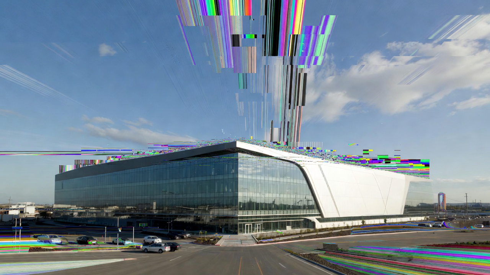

# Level 1: SPACESIM

En esta práctica vas a **tomar el control** de una simulación gravitatoria N-cuerpos del sistema solar.

## Contexto: la misión está en tus manos



Año 2028. Un misterioso glitch cuántico ha borrado del mapa a **todos** los ingenieros de [verificación y validación](https://en.wikipedia.org/wiki/Verification_and_validation) de SpaceX. La misión tripulada a Marte pende de un hilo.

**Tu tarea**: analizar, corregir y optimizar una simulación numérica que permita predecir con la precisión suficiente la trayectoria de la nave Starship y garantizar que llegue a Marte en el lugar correcto… y entera.

¡La humanidad cuenta contigo!

## Primeros pasos – Preparación del entorno

1. Instala [Microsoft Visual Studio](https://www.visualstudio.com/) → selecciona la carga de trabajo **“Desarrollo para el escritorio con C++”**.

2. Instala Git → <https://git-scm.com/downloads>

3. Instala [vcpkg](https://vcpkg.io/) (gestor de paquetes de C++).

    **Windows**

    ``` bash
    mkdir C:\dev
    cd C:\dev
    git clone https://github.com/Microsoft/vcpkg.git
    .\vcpkg\bootstrap-vcpkg.bat
    .\vcpkg\vcpkg integrate install
    ```

    **Linux/macOS**

    ``` bash
    mkdir ~/dev
    cd ~/dev
    git clone https://github.com/Microsoft/vcpkg.git
    ./vcpkg/bootstrap-vcpkg.sh
    ./vcpkg/vcpkg integrate install
    ```

4. Los ingenieros glitcheados dejaron sólo este repositorio. Ábrelo en Visual Studio, y compila y ejecuta los targets `sim_visualizer` (visualización 3D interactiva, útil para debugging visual) y `sim_headless` (simulación sin gráficos, para mediciones rápidas).

5. Parece que el glitch cuántico no sólo afectó a los ingenieros… ¡también dejó el código lleno de errores sutiles y no tan sutiles! Trata de comprenderlo para determinar qué debes corregir. Para ello la información a continuación te será muy útil.

## Physics brushup: Ley de gravitación

La **fuerza gravitatoria** que ejerce el cuerpo *j* (masa $m_j$, posición $\mathbf{r}_j$) sobre el cuerpo *i* (masa $m_i$, posición $\mathbf{r}_i$) está dada por:

$$
\mathbf{F}_{i \leftarrow j} = -G \frac{m_i m_j}{|\mathbf{r}_i - \mathbf{r}_j|^2} \, \hat{\mathbf{u}}_{j \to i}
$$

donde $\hat{\mathbf{u}}_{j \to i}$ es el **vector unitario** que apunta **desde** *j* **hacia** *i*:

La **constante de gravitación universal** vale:

$$
G = 6.67430 \times 10^{-11} \, \mathrm{m}^3 \mathrm{kg}^{-1} \mathrm{s}^{-2}
$$

La **fuerza neta** sobre el cuerpo *i* es la suma vectorial de todas las contribuciones:

$$
\mathbf{F}_i = \sum_{\substack{j=1 \\ j \neq i}}^N \mathbf{F}_{i \leftarrow j}
$$

De aquí se obtiene directamente la **aceleración** (segunda ley de Newton):

$$
\mathbf{a}_i = \frac{\mathbf{F}_i}{m_i}
$$

Para conocer cómo cambian las posiciones y velocidades con el tiempo, debemos resolver el siguiente sistema de ecuaciones diferenciales ordinarias (EDOs) de primer orden:

$$
\frac{d \mathbf{v}_i}{dt} = \mathbf{a}_i(\mathbf{r}_1, \dots, \mathbf{r}_N) \qquad \text{(ecuación del movimiento)}
$$

$$
\frac{d \mathbf{r}_i}{dt} = \mathbf{v}_i \qquad \text{(ecuación de la velocidad)}
$$

donde $i = 1, 2, \dots, N$.

En la práctica se emplean **métodos de integración numérica** para aproximar la solución de estas ecuaciones diferenciales. Estos métodos avanzan la simulación en pequeños incrementos de tiempo llamados **pasos de tiempo** (*time steps*, Δt).

Cuanto más pequeño sea el paso temporal, mayor será la precisión de la simulación, aunque también aumentará el costo computacional, ya que será necesario realizar más pasos para cubrir el mismo intervalo de tiempo.

En este repositorio, los ingenieros glitcheados utilizaron el **método de Euler**: en cada paso de tiempo, el algoritmo calcula la aceleración gravitatoria que actúa sobre cada cuerpo y luego actualiza su velocidad y su posición usando ese valor.

## La misión a rescatar

Una vez que comprendas el código, realiza las siguientes tareas:

* **Encuentra** y **corrige** todos los errores (físicos, numéricos, de programación) del módulo `physics/solver`. Documenta el proceso de debugging en el archivo `ENTREGA.md`, **justificando:**

  * cada error que encuentres,
  * cómo lo identificaste,
  * y por qué tu solución es correcta.

  Usa la guía `NO-ANDA.md` y tus habilidades de debugging para entender qué está mal.

* **Verifica y valida** el simulador:

  * Investiga requisitos realistas de precisión para aterrizaje en Marte (referencias actuales: misión Perseverance, misiones humanas).
  * Utiliza las efemérides `2028-12-31_00-00-00.csv` como estado inicial del sistema solar. Determina el time step óptimo, validando tus resultados contra las efemérides de referencia `2029-08-28_00_00_00.csv`. Escribe el código en el módulo `physics/mission`.
  * Opcional (con bonus points): Investiga y compara métodos de integración numérica avanzados (RK4, Adams-Bashforth, symplectic, etc.). Elige y justifica el más adecuado para este problema.
  * Documenta todo en `ENTREGA.md`.

* **Optimiza** el simulador:

  * Identifica y elimina los cuellos de botella computacionales y de memoria del módulo `physics/solver`.
  * Mantén la precisión requerida para la misión (no sacrifiques exactitud por velocidad si compromete el aterrizaje).
  * Determina la complejidad computacional y de memoria de tu algoritmo.
  * Opcional (con bonus points): Considera la seguridad y evita que la nave pase peligrosamente cerca de asteroides.
  * Documenta todo en `ENTREGA.md`.

* **Diseña y simula** una misión a marte simplificada, partiendo de la órbita inicial de la nave:

  * Implementa tu misión en el módulo `physics/mission`.
  * Lanza alrededor del 31 de diciembre de 2028.
  * Calcula y aplica un impulso TMI (Trans-Mars Injection) realista (~3 - 5 km/s), es decir, un cambio de velocidad que coloca la nave en una trayectoria de transferencia hacia Marte.
  * Simula el viaje interplanetario. Si resulta necesario, realiza correcciones de trayectoria de medio curso (no más de 100 m/s en total). Considera ajustar el time step en función de cada etapa de la misión.
  * Aplica un impulso MOI (Mars Orbit Insertion) para capturar la nave en órbita elíptica → idealmente circular (~0.8–1.5 km/s).
  * Documenta en `ENTREGA.md`:
  
    * Δv total empleado
    * Trayectorias (gráficos si es posible)
    * Tiempo y magnitud de cada maniobra
    * Dificultades encontradas y soluciones

## Recomendaciones

* Los ingenieros glitcheados utilizaron el estilo de programación [Google C++](https://google.github.io/styleguide/cppguide.html) con comentarios en estilo [Doxygen](https://www.doxygen.nl/manual/docblocks.html). Úsalos tú también.
* Usa Git. Si necesitas ayuda: [Learn GitHub within GitHub](https://learn.github.com/skills)
* No modifiques los archivos `main` ni `renderer`.
* No modifiques los archivos de efemérides.
* Antes de consultar a los ayudantes, consulta a [ChatGPT](https://chatgpt.com/), [Gemini](https://gemini.google.com/), [Claude](https://claude.ai/), [Grok](https://grok.com/), etc. ¡Te lo agradecerán!

## Referencias

* Las efemérides fueron generadas con [Skyfield](https://rhodesmill.org/skyfield/), [DE441](https://ssd.jpl.nasa.gov/planets/eph_export.html) y [MPCORB](https://www.minorplanetcenter.net/iau/MPCORB.html).
